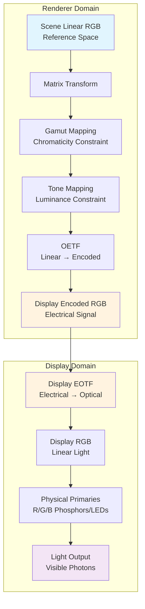

# OCIO Display Color Pipeline Documentation

## Overview

This document describes the complete color transformation pipeline from scene-linear RGB to display light output, including both the renderer's color pipeline and the display's internal processing.

## Complete System Architecture

### Full Information Flow



### Domain Boundaries

- **Renderer Domain**: Our OCIO color pipeline (software)
- **Display Domain**: Display hardware (EOTF + primaries)
- **Interface**: Display Encoded RGB (electrical signal)

### Key Relationship

The renderer's **OETF** must be the mathematical **inverse** of the display's **EOTF**:
```
Renderer OETF = Display EOTF⁻¹
```

This ensures that:
```
Linear Light → [OETF] → Encoded → [EOTF] → Linear Light
```

## Pipeline Architecture

### Renderer Transform Sequence

```
Scene Linear RGB → [Matrix Transform] → [Gamut Mapping] → [Tone Mapping] → [OETF] → Display Encoded RGB
```

### Display Transform Sequence

```
Display Encoded RGB → [Display EOTF] → Display RGB Linear → [Physical Primaries] → Light Output
```

## Stage-by-Stage Breakdown

### Stage 1: Matrix Transform (Reference Space → Display Primaries)

**Purpose**: Convert from OCIO reference space RGB to display's native RGB primaries

**Input**: Scene-linear RGB in reference space (e.g., ACEScg AP1 primaries)
- **Data Type**: `float32`
- **Range**: Unlimited (`-∞` to `+∞`)
- **Color Space**: Reference space primaries (typically ACEScg)

**Transform**: `RGB_display = [Matrix] × RGB_reference`

**Output**: Scene-linear RGB in display primaries
- **Data Type**: `float32` 
- **Range**: Unlimited (can be negative or >1.0)
- **Color Space**: Display primaries

**Key Points**:
- Matrix converts between different RGB coordinate systems
- Does NOT clip values - preserves full dynamic range
- Out-of-gamut colors become negative or >1.0 values
- HDR content (>1.0) is preserved

### Stage 2: Gamut Mapping (Chromaticity Constraint)

**Purpose**: Handle colors that cannot be reproduced by display primaries

**Input**: Display RGB with possible negative/impossible values
- **Example**: `[1.5, -0.2, 2.0]` (impossible cyan, too bright)

**Constraint Applied**: Chromaticity (color purity/hue)
- **What it fixes**: Negative values, impossible color combinations
- **What it preserves**: Luminance relationships, brightness ratios

**Naive Implementation Strategy**: 
```python
def naive_gamut_map_preserve_luminance(rgb):
    # Calculate relative luminance
    luminance = 0.2126*rgb[0] + 0.7152*rgb[1] + 0.0722*rgb[2]
    
    if luminance <= 0:
        return [0.0, 0.0, 0.0]
    
    # Normalize to unit luminance for chromaticity mapping
    normalized_rgb = rgb / luminance
    
    # Clip chromaticity to valid range (naive strategy)
    clipped_chrom = np.clip(normalized_rgb, 0.0, 1.0)
    
    # Restore original luminance (preserving brightness)
    result = clipped_chrom * luminance
    
    return result
```

**Output**: Display RGB with valid chromaticity, preserving luminance
- **Data Type**: `float32`
- **Range**: 0 to unlimited (can still be >1.0 for bright content)
- **Guarantee**: All values ≥ 0, reproducible by display primaries

### Stage 3: Tone Mapping (Luminance Constraint)

**Purpose**: Handle content brighter than display peak luminance

**Input**: Valid display RGB that may exceed display capabilities
- **Example**: `[2.5, 2.3, 2.8]` (valid color, too bright)

**Constraint Applied**: Luminance (brightness)
- **What it fixes**: Values exceeding display peak (typically >1.0)
- **What it preserves**: Color relationships, chromaticity ratios

**Naive Implementation Strategy**:
```python
def naive_tone_map_preserve_chromaticity(rgb, max_luminance=1.0):
    # Find the maximum component (simple luminance proxy)
    max_component = max(rgb)
    
    if max_component <= max_luminance:
        return rgb  # No tone mapping needed
    
    # Scale all components proportionally (preserves chromaticity)
    scale_factor = max_luminance / max_component
    result = rgb * scale_factor
    
    return result
```

**Output**: Display RGB within display capabilities
- **Data Type**: `float32`
- **Range**: 0.0 to 1.0
- **Guarantee**: Fits within display's dynamic range

### Stage 4: OETF Application (Linear → Encoded)

**Purpose**: Apply Opto-Electronic Transfer Function to match display's response

**Input**: Linear display RGB (scene-referred, optical domain)
- **Range**: 0.0 to 1.0

**Transform**: Converts optical intensity to electrical encoding
- **PQ**: `rgb_encoded = ST2084_OETF(rgb_linear)`
- **HLG**: `rgb_encoded = HLG_OETF(rgb_linear)` 
- **Gamma**: `rgb_encoded = pow(rgb_linear, 1/gamma)`

**Output**: Encoded display RGB (display-referred, electrical domain)
- **Data Type**: `float32`
- **Range**: 0.0 to 1.0 (ready for display)

---

## Display Domain Stages

### Stage 5: Display EOTF (Encoded → Linear)

**Purpose**: Convert electrical signal back to linear light intensity (display property)

**Input**: Encoded display RGB (electrical signal from renderer)
- **Range**: 0.0 to 1.0
- **Domain**: Electrical (encoded)

**Transform**: Display's electro-optical transfer function
- **PQ Display**: `rgb_linear = ST2084_EOTF(rgb_encoded)` 
- **HLG Display**: `rgb_linear = HLG_EOTF(rgb_encoded)`
- **Gamma Display**: `rgb_linear = pow(rgb_encoded, gamma)`

**Output**: Linear display RGB (optical domain)
- **Data Type**: `float32` 
- **Range**: 0.0 to peak_nits/reference_white ratio
- **Domain**: Optical (linear light)

**Key Point**: This EOTF is a **display property** - we don't control it, we must match it.

### Stage 6: Physical Primaries (Linear → Light)

**Purpose**: Convert linear RGB values to actual light emission

**Input**: Linear display RGB in display's native primaries

**Transform**: Physical light emission
- **LED Displays**: PWM duty cycle × LED spectrum 
- **OLED Displays**: Current × organic compound emission
- **Phosphor Displays**: Electron beam × phosphor spectrum

**Output**: Visible light with measured spectral characteristics
- **Red**: Light at measured red primary chromaticity
- **Green**: Light at measured green primary chromaticity  
- **Blue**: Light at measured blue primary chromaticity
- **Intensity**: Linear relationship to electrical signal (after EOTF)

## Key Concepts

### Chromaticity vs Luminance

**Chromaticity**: The "color" aspect - hue and saturation
- Determined by the ratios between R, G, B values
- Example: `[0.8, 0.2, 0.1]` and `[1.6, 0.4, 0.2]` have same chromaticity

**Luminance**: The "brightness" aspect - how much light
- Determined by the absolute magnitude of RGB values
- Example: `[1.6, 0.4, 0.2]` is twice as bright as `[0.8, 0.2, 0.1]`

### Why This Order Matters

1. **Matrix First**: Must convert to target primaries before gamut mapping
2. **Gamut Then Tone**: Separate orthogonal constraints
   - Gamut mapping fixes impossible colors while preserving brightness
   - Tone mapping fixes excessive brightness while preserving color
3. **OETF Last**: Converts from optical (linear) to electrical (encoded) domain

## Complete Data Flow Example

**Input**: `[1.2, -0.1, 2.5]` (bright impossible cyan in ACEScg)

### Renderer Domain (Our OCIO Pipeline)

```
Stage 1 - Matrix Transform (ACEScg → Display):
[1.2, -0.1, 2.5] → [1.5, -0.2, 2.0] (still impossible, but in display space)

Stage 2 - Gamut Mapping (fix chromaticity):
[1.5, -0.2, 2.0] → [0.8, 0.3, 2.0] (valid color, still bright)

Stage 3 - Tone Mapping (fix luminance):  
[0.8, 0.3, 2.0] → [0.4, 0.15, 1.0] (scaled down proportionally)

Stage 4 - OETF (linear → encoded):
[0.4, 0.15, 1.0] → [0.73, 0.44, 1.0] (gamma 2.4 example)
```

**Renderer Output**: `[0.73, 0.44, 1.0]` - electrical signal sent to display

### Display Domain (Display Hardware)

```
Stage 5 - Display EOTF (encoded → linear):
[0.73, 0.44, 1.0] → [0.4, 0.15, 1.0] (gamma 2.4 EOTF, back to linear)

Stage 6 - Physical Primaries (linear → light):
[0.4, 0.15, 1.0] → Light emission:
  - Red LED at 40% intensity (measured red primary spectrum)
  - Green LED at 15% intensity (measured green primary spectrum)  
  - Blue LED at 100% intensity (measured blue primary spectrum)
```

**Final Output**: Visible light with the intended color and brightness

### Key Insight

Notice how Stages 4 and 5 are mathematical inverses:
- **Stage 4 (OETF)**: `[0.4, 0.15, 1.0] → [0.73, 0.44, 1.0]` (linear→encoded)
- **Stage 5 (EOTF)**: `[0.73, 0.44, 1.0] → [0.4, 0.15, 1.0]` (encoded→linear)

This round-trip preserves the intended linear light values.

## Implementation Notes

### Reference Space Detection

The base OCIO config's reference space must be determined:
- **Studio configs**: Typically ACEScg (AP1 primaries)
- **ACES configs**: ACEScg (AP1 primaries)  
- **Custom configs**: Must be queried from config

### Matrix Creation

Use colour-science library to create RGB→RGB transformation matrices:
```python
import colour

# Define reference space (e.g., ACEScg)
reference_space = colour.RGB_COLOURSPACES['ACEScg']

# Define display space from measured primaries
display_space = colour.RGB_Colourspace(
    name='Custom Display',
    primaries=display_primaries,  # Measured [R, G, B] xy coordinates
    whitepoint=display_whitepoint,  # Measured xy coordinates
    name='Custom'
)

# Create direct RGB→RGB conversion matrix
matrix = colour.matrix_RGB_to_RGB(reference_space, display_space)
```

### Advanced Strategies (Future)

Once the naive pipeline is working, these can be improved:

**Gamut Mapping**:
- Perceptual: Smooth compression using LCH space
- Saturation: Preserve color purity while adjusting lightness
- Relative: Proportional scaling to gamut boundary

**Tone Mapping**:
- Reinhard: Smooth compression using `L/(1+L)` curve
- ACES: Filmic S-curve for natural rolloff
- Exposure: Photographic-style adjustments

## Validation and Testing

Each stage should be testable independently:
1. **Matrix**: Test with known color conversions
2. **Gamut**: Test with out-of-gamut synthetic colors  
3. **Tone**: Test with HDR content
4. **OETF**: Test against reference implementations

The corrected pipeline ensures accurate color reproduction while handling the full range of possible input content.