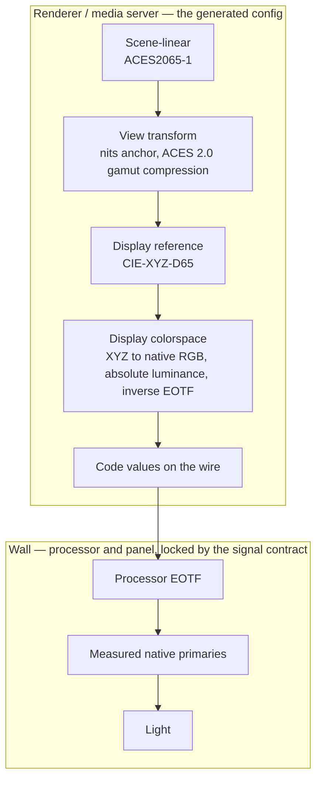

# OCIO Custom Display Configuration Generator

The **generate layer** of [color-wrangler](https://github.com/Fuse-Technical-Group/color-wrangler) — characterization-based color management for real-time playback on LED surfaces. System architecture, measurement sessions, and verification policy live in the umbrella; this repo turns measurements into OCIO configs.

A tool for creating and appending[^1] custom display colorspaces to existing OpenColorIO (OCIO) configurations, using measured display data including custom primaries, white point, luminance, and EOTF characteristics.

The goal of this system is to have the renderer or compositor handle the
color transformation to the display's native gamut, rather than having
an unknown algorithm in the display do the transformation.

## Where the boundary is

Everything left of the wire is the generated config, in float. The wall
applies its own EOTF and its own primaries; the config's job is to land
the code values that make those produce the intended light.



The inverse EOTF and the processor's EOTF are inverses by construction,
which holds only while the processor stays in the state the manifest
records — see [SPEC.md](SPEC.md) §spec:signal-contract.

## What it emits

For one measured wall, a single self-contained `.ocio` file registering
that wall as a named display with three selectable views — VP
Radiometric (default), ACES 2.0, and Colorimetric — plus the
verification artifacts below. The views are fixed: out-of-gamut and
above-peak handling is a property of the view the operator picks, not a
configurable strategy. Rationale in [SPEC.md](SPEC.md)
§spec:view-transform.

## Quick Start

### Option 1: Using Astral UV package management (Recommended)

1. **Install UV** (if not already installed):

   ```bash
   # On Windows
   powershell -c "irm https://astral.sh/uv/install.ps1 | iex"
   
   # On macOS/Linux
   curl -LsSf https://astral.sh/uv/install.sh | sh
   ```

2. **Install dependencies and create virtual environment**:

   ```bash
   uv sync
   ```

3. **Edit configuration files**:
   - `show_manifest.yaml` - Your show decisions (naming, signal contract, base config selection) and the promotion pointer to the measurements artifact
   - `measurements/ftg_stage1_20240115.yaml` - Measurements artifact of record (machine-format; the shipped file is a hand-built sample)
   - `validation_settings.yaml` - Validation parameters (optional, uses defaults if missing)

4. **Generate custom configuration**:

   ```bash
   uv run ./OCIODisplayGen.py
   ```

### Option 2: Using Traditional pip Python package management

1. **Install dependencies**:

   ```bash
   pip install -e .
   ```

2. **Edit configuration files**:
   - `show_manifest.yaml` - Your show decisions (naming, signal contract, base config selection) and the promotion pointer to the measurements artifact
   - `measurements/ftg_stage1_20240115.yaml` - Measurements artifact of record (machine-format; the shipped file is a hand-built sample)
   - `validation_settings.yaml` - Validation parameters (optional, uses defaults if missing)

3. **Generate custom configuration**:

   ```bash
   python OCIODisplayGen.py
   ```

## Verification Handoff

Each run writes two more artifacts beside the config
(`custom_display_config.ocio` in the shipped sample):

- `custom_display_config.predictions.yaml` — for each probe patch, the
  scene-linear content that produces it, the code values the config
  emits, and the CIE XYZ the wall is predicted to emit in cd/m². Bound
  to the config by sha256; never hand-edited.
- `custom_display_config.probe/` — one solid-color 16-bit PNG per
  patch, holding exactly those code values.

Display the probe images on the wall, measure each patch, and compare
the measurements against the predictions. Judging the residuals
(ΔE2000, unity exponent) belongs to OLE-Toolset, not to this tool.

To identify a predictions file found on a show machine and confirm it
still describes the config sitting next to it:

```bash
uv run ./OCIODisplayGen.py --check-predictions custom_display_config.predictions.yaml
```

It exits nonzero when the config's bytes no longer match the recorded
hash — those predictions describe a different config.

## Configuration Files

### Show manifest (`show_manifest.yaml`)

Human-authored and reviewed. Contains:

- Show naming (panel and processor identity)
- Intended processor signal contract (EOTF, intensity, processing state)
- Base OCIO configuration selection (type, versions)
- White point policy and VP Radiometric settings (nits anchor, overflow policy)
- Validation mode
- Promotion pointer to the measurements artifact of record:
  `measurements: {file, sha256}`

### Measurements artifact (`measurements/*.yaml`)

Machine-written by a characterization session, immutable, never
hand-edited (the shipped `measurements/ftg_stage1_20240115.yaml` is a
hand-built sample). Contains measured primaries and white point, black
level and peak luminance, ambient floor, instrument identity,
processor-state snapshot, and timestamps. Accept a measurement run by
recording its sha256 in the show manifest's promotion pointer;
generation refuses when the artifact on disk no longer matches the
recorded hash.

The shipped `show_manifest.yaml` and `measurements/ftg_stage1_20240115.yaml`
are a working example; see those files for the schema.

## Base OCIO Configuration Selection

The system loads base configurations using the `ocio://` scheme, which provides access to pre-built OCIO configurations:

### Configuration Types

- **`studio`**: Studio workflow configuration (default)
- **`cg`**: CG workflow configuration

### Version Components

- **`config_version`**: Configuration version (e.g., "v4.0.0", "v2.1.0")
- **`aces_version`**: ACES version (e.g., "v2.0", "v1.3")
- **`ocio_version`**: OCIO version (e.g., "v2.5", "v2.3")

### Available Configurations

The system constructs URLs in the format:

```text
ocio://{type}-config-{config_version}_aces-{aces_version}_ocio-{ocio_version}
```

OCIO 2.5.1 carries eight builtin configs — `studio-config` and
`cg-config`, each in v1.0.0, v2.1.0, v2.2.0, and v4.0.0. The two this
project targets:

- **`ocio://studio-config-v4.0.0_aces-v2.0_ocio-v2.5`** — ACES 2.0
  studio workflow; the shipped sample default
- **`ocio://studio-config-v2.1.0_aces-v1.3_ocio-v2.3`** — ACES 1.3
  studio workflow

The ACES 2.0 views need a config profile of at least 2.4; generation
fails loud on a base config that cannot hold them. To enumerate the
registry for a different OCIO version:

```python
import PyOpenColorIO as OCIO
print(list(OCIO.BuiltinConfigRegistry()))
```

## Usage

1. **Set OCIO environment variable**:

   ```bash
   # On Windows (PowerShell)
   $env:OCIO = "C:\path\to\your\custom_display_config.ocio"
   
   # On macOS/Linux
   export OCIO=/path/to/your/custom_display_config.ocio
   ```

2. **Select the wall as your display**:
   - The generated display carries the show's panel and processor
     identity as its name; pick the view for the job — VP Radiometric
     for plates, ACES 2.0 for finished content, Colorimetric for
     measurement.

## Documentation

- [SPEC.md](SPEC.md) — what this component generates and why: the
  colorspace/view split, the rendering intents, white point policy,
  predictions, provenance
- [REQUIREMENTS.md](REQUIREMENTS.md) and [ROADMAP.md](ROADMAP.md) —
  scope and what is still open
- [OCIO_BUILTIN_TRANSFORMS.md](OCIO_BUILTIN_TRANSFORMS.md) — builtin
  transforms that do not exist, pinned to a checked OCIO version
- [color-wrangler](https://github.com/Fuse-Technical-Group/color-wrangler)
  — the system: architecture, measurement sessions, verification policy

## Requirements

- Python 3.11+
- PyOpenColorIO 2.5.1+
- colour-science 0.4.6+
- PyYAML 6.0+

## License

BSD 3-Clause License - see [LICENSE](LICENSE) file for details.

[^1]: We append/modify rather than creating a dedicated OCIO config because many (?) systems such as Disguise that can use OCIO can only load one config at a time, and cannot merge OCIO components at runtime.
